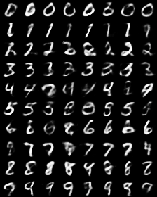
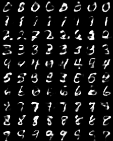

# VAE + (Conditioned) Quantile Networks for MNIST
PyTorch VAE example extended with Autoregressive Quantile Networks (though, they aren't autoregressive when applied to VAE) https://arxiv.org/abs/1806.05575

By default, writes tensorboard logs to `./tensorboard`, change with `--log-folder /log/path`. Saving just png images without tensorboard is not implemented.

With `--conditioned` argument AIQN network also receives class labels as inputs. VAE encoder / decoder does not have access to class labels.

## Requirements
PyTorch 0.4.0

tensorboard-pytorch https://github.com/lanpa/tensorboard-pytorch

## Running
Conditioned AIQN with 1 KL penalty `main.py --conditioned --kl-scale 1 --log-folder ./tensorboard`

No AIQN with 1 KL penalty (same as PyTorch example) `main.py --no-aiqn --kl-scale 1 --log-folder ./tensorboard`

## Examples

#### No AIQN / AIQN with 1 KL penalty. AIQN gives only little improvements.
 

#### No AIQN / AIQN with 0 KL penalty. Without AIQN and KL penalty generated images are mess. AIQN gives noticible improvement.
 

#### Conditioned AIQN with 1 / 0 KL penalty.
 
