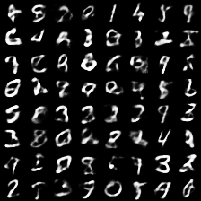
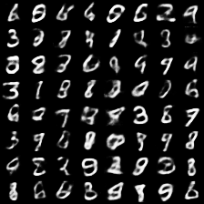
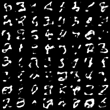
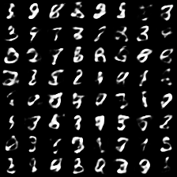

# AIQN-VAE
PyTorch VAE example extended with Autoregressive Quantile Networks https://arxiv.org/abs/1806.05575

## Running
AIQN with 1 KL penalty `main.py --kl-scale 1`

No AIQN with 1 KL penalty (same as PyTorch example) `main.py --no-aiqn --kl-scale 1`

## Examples

#### No AIQN / AIQN with 1 KL penalty
 

#### No AIQN / AIQN with 0 KL penalty
 
